<div align="center">

# 🚛 Tracc

### AI Operations Copilot for US Freight

**Live KPIs · Explainable delay prediction · Safe Text-to-SQL · Citation-enforced SOP RAG · Workflow automation**

*Eliminate manual document searching, fragmented spreadsheets, and reactive delay troubleshooting.*

<br/>

[](https://tracc-five.vercel.app/)
[](https://tracc-backend.onrender.com/docs)

[](backend/requirements.txt)
[](backend/app/main.py)
[](frontend/package.json)
[](docker-compose.yml)
[](docker-compose.yml)
[](tests/test_api.py)
[](LICENSE)

<br/>

[**Live Demo**](#-live-demo) ·
[**Screenshots**](#-screenshots) ·
[**Why Tracc**](#why-tracc) ·
[**Features**](#-features) ·
[**Architecture**](#architecture) ·
[**Quickstart**](#-quickstart) ·
[**API**](#-api-reference) ·
[**Docs**](#-documentation)

</div>

<details>
<summary><b>Contents</b></summary>

- [✨ Overview](#-overview)
- [🌐 Live Demo](#-live-demo)
- [📸 Screenshots](#-screenshots)
- [❓ Why Tracc](#why-tracc)
- [🧩 Features](#-features)
- [🏗️ Architecture](#architecture)
- [🔮 Explainable Delay Prediction](#explainable-delay-prediction)
- [🛠️ Tech Stack](#tech-stack)
- [🔁 How It Ships](#how-it-ships)
- [🚀 Quickstart](#-quickstart)
- [📡 API Reference](#-api-reference)
- [✅ Quality & Testing](#quality--testing)
- [📁 Project Structure](#project-structure)
- [📚 Documentation](#-documentation)
- [🗺️ Roadmap](#roadmap)
- [⚖️ Known Limitations](#known-limitations)
- [❓ FAQ](#faq)
- [🤝 Contributing](#-contributing)
- [📄 License](#-license)

</details>

<br/>

> [!IMPORTANT]
> **Tracc assists; humans decide.** The copilot recommends, analyzes, summarizes, and alerts — every operational decision stays with your dispatchers and managers.

<p align="center">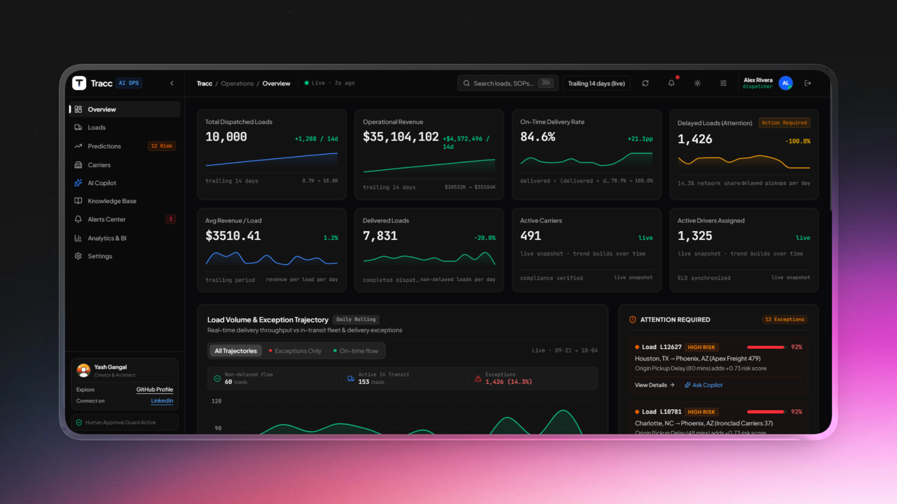</p>

---

## ✨ Overview

Freight operations run on scattered tools: SOPs buried in PDFs, KPIs in spreadsheets, and delays discovered only after they hurt. **Tracc** puts everything a dispatcher needs behind one interface:

| | |
|---|---|
| 📊 **See** | A live operations dashboard: loads, on-time delivery, revenue, carrier performance, lane analytics, and a real-time fleet event feed. |
| 🔮 **Predict** | Per-load late-delivery probability, with SHAP factor attribution translated into plain dispatcher language. |
| 💬 **Ask** | One ChatGPT-style copilot that routes between chit-chat, guarded SQL analytics, SOP retrieval, and a transparent ReAct agent. |
| ⚡ **Act** | An incident center with one-click resolution, plus n8n-powered automations for delays, daily briefings, and carrier breaches. |

---

## ❓ Why Tracc

Dispatch teams live in one painful loop:

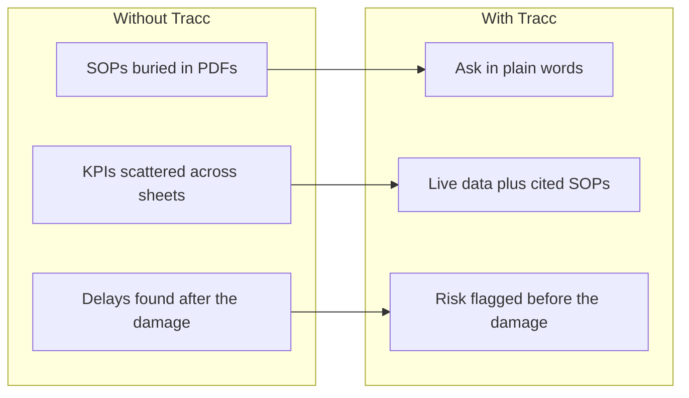

| Old way | The Tracc way |
|---|---|
| Hunt through PDFs for the breakdown procedure | Ask; get the cited SOP section in seconds |
| Export CSVs to compute on-time delivery | Live OTD %, revenue, and lanes on one dashboard |
| Find out about delays from angry consignees | ML flags at-risk loads with plain-English reasons |
| Hand-write the daily briefing | Automated 07:00 ops report, idempotent per day |
| Guess which carrier to trust | Leaderboard with real 7-week OTD history per carrier |

---

## 🌐 Live Demo

| | |
|---|---|
| **App** | **<https://tracc-five.vercel.app/>** (sign in with a [demo account](#demo-accounts)) |
| **API docs** | <https://tracc-backend.onrender.com/docs> |

> [!NOTE]
> Free-tier hosting sleeps when idle. The first visit after ~15 minutes can take about a minute to wake up.

### ⏱️ 60-second tour

1. **Log in as the dispatcher** → live KPIs, revenue trajectory, and carrier leaderboard.
2. **Open a load** → route, carrier/driver, delivery timeline, and live SHAP delay risk.
3. **Ask the copilot** → `hi` → `How is driver Garcia doing?` → `What is his safety score?` (one thread, routed automatically).
4. **Upload an SOP as manager**, then delete it from the Knowledge Base.
5. **Trigger `workflow_a`** from the Alerts Center → watch the incident appear → resolve it.

---

## 📸 Screenshots

| 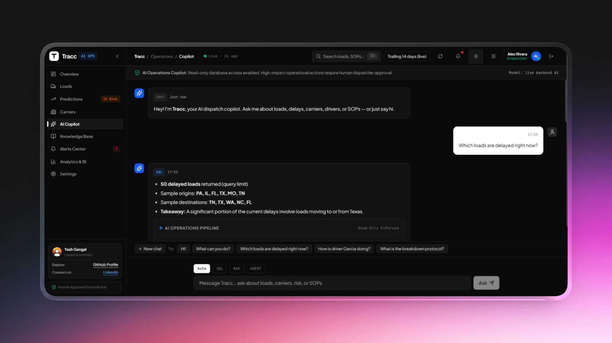 | 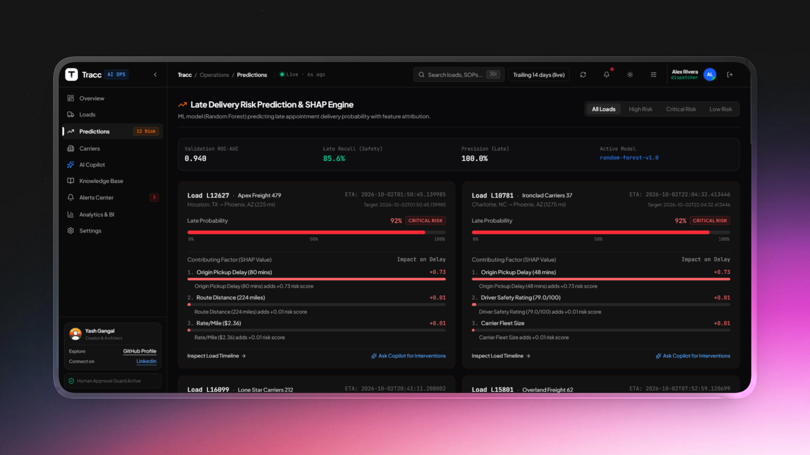 |
|---|---|
| 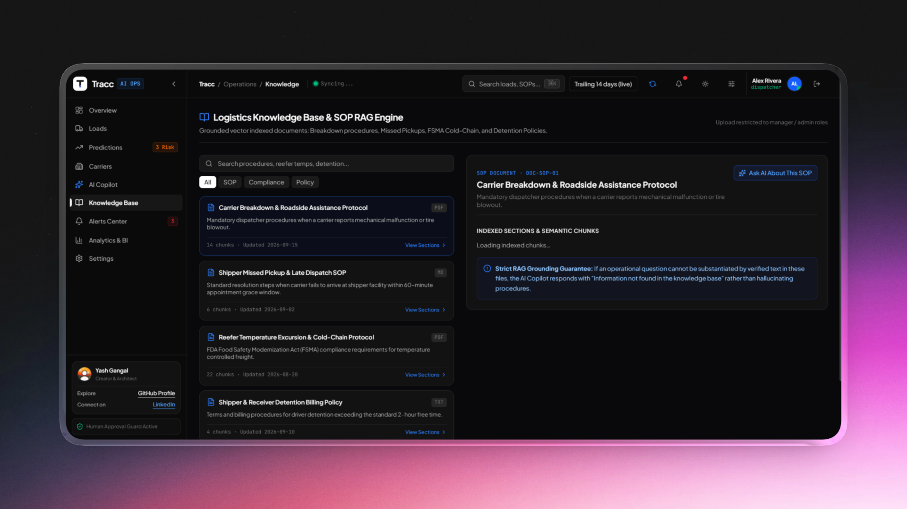 | 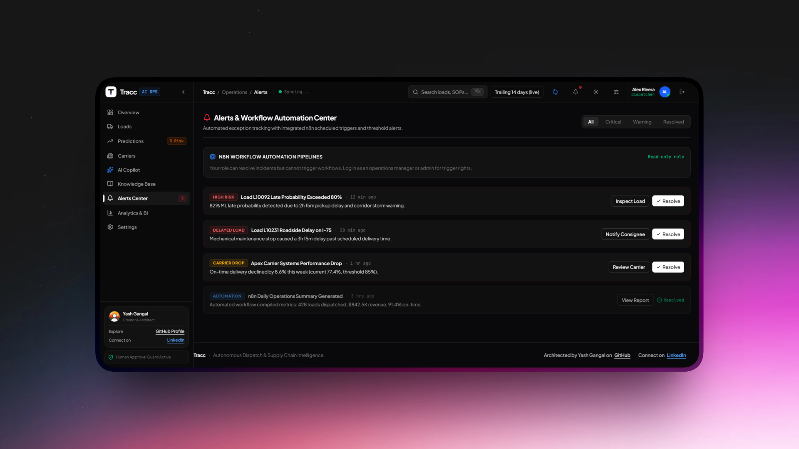 |

---

## 🧩 Features

| Area | Capability |
|---|---|
| **Operations dashboard** | Live KPIs (loads, OTD %, revenue, carriers), 14-day revenue trajectory, carrier leaderboard with real 7-week OTD sparklines, lane analytics, live fleet event feed. |
| **Load board** | Searchable, filterable dispatches with a slide-over detail drawer: route, carrier/driver, delivery-event timeline. |
| **ML delay-risk center** | Late-delivery probability per load, with SHAP attribution such as *"Origin pickup delay adds +X risk"*. |
| **AI Copilot** | Unified chat on `POST /copilot/chat` (SSE streaming at `/copilot/chat/stream`) with session memory, name-based driver/carrier/load resolution, safe read-only **Text-to-SQL** with self-repair, citation-enforced **SOP RAG**, and a **ReAct agent** with visible *Thought → Action → Observation* traces. |
| **Knowledge base** | 5 official SOPs indexed permanently. Managers can upload (`.md` / `.txt` / `.pdf`, up to 10 MB) and delete wrongly uploaded documents. |
| **Incident center** | Active alert feed, one-click resolve, and manual triggers for the delayed-load, daily-ops-briefing, and high-risk-carrier workflows. |
| **Automation** | n8n workflow definitions plus a native in-app runner for instant testing. |
| **Analytics export** | Power BI star-schema CSV exporter (`Fact_Loads`, `Dim_Carrier`, `Dim_Driver`, `Dim_Customer`, `Dim_Route`) with a DAX guide. |
| **Platform** | JWT auth with 4 roles, audit logging, rate limits, guarded SQL (AST validation + table whitelist), dark/light themes, keyboard-accessible UI with reduced-motion support. |

---

## 🏗️ Architecture

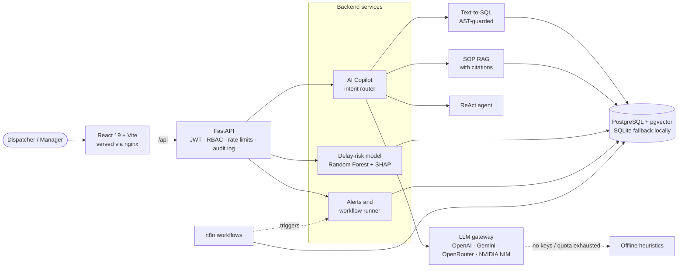

### The Copilot, in detail

A single conversation thread is routed automatically, so dispatchers never have to choose a "mode".

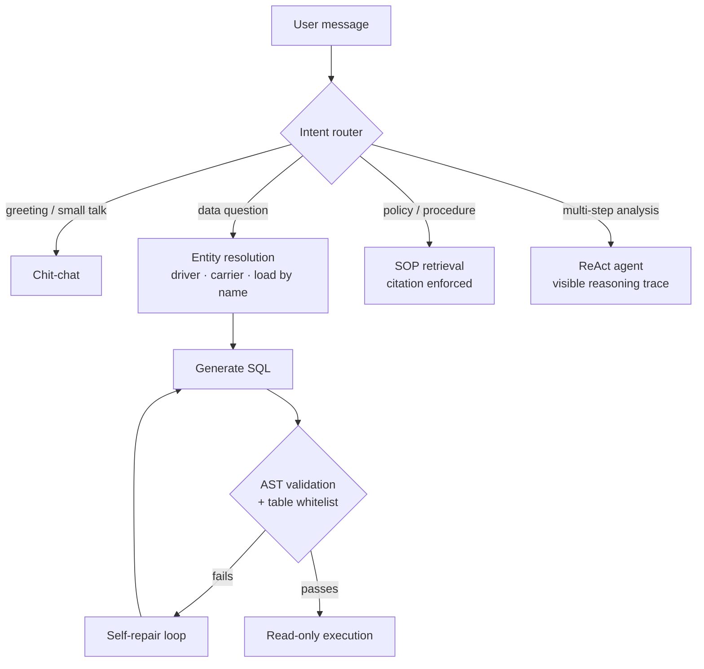

**Safety by design:** generated SQL is parsed and validated against an AST, restricted to a table whitelist, and executed read-only. SOP answers must cite their source documents.

### Request lifecycle

What happens between Enter and answer, using a delayed-loads question as the trace:

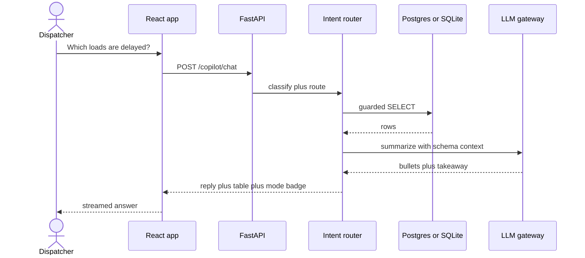

---

## 🔮 Explainable Delay Prediction

Every load carries a late-delivery probability from a scikit-learn **Random Forest**, with a **SHAP TreeExplainer** translating model internals into language a dispatcher can act on. Serialized artifacts keep inference in the sub-millisecond range.

| Metric | Score |
|---|---|
| Accuracy | **0.977** |
| Precision | **1.000** |
| Recall | **0.856** |
| F1 | **0.923** |

<sub>Model `random-forest-v1.0`. The version and metrics are read dynamically from `benchmark_metrics.json`. Figures reflect the project's seeded synthetic dataset.</sub>

| Risk band | Threshold |
|---|---|
| 🔴 **HIGH** | probability ≥ 0.65 |
| 🟠 **MEDIUM** | probability ≥ 0.30 |
| 🟢 **LOW** | below 0.30 |

Bands are tunable in [`backend/app/core/business_rules.py`](backend/app/core/business_rules.py). On-time delivery is defined as `delivered / (delivered + delayed)`.

---

## 🛠️ Tech Stack

| Layer | Technology |
|---|---|
| **Backend** | FastAPI · SQLAlchemy · Pydantic v2 · JWT + bcrypt |
| **Data** | PostgreSQL + pgvector (Docker), with automatic SQLite fallback for local development |
| **Machine learning** | scikit-learn Random Forest · SHAP TreeExplainer |
| **AI providers** | OpenAI / Gemini / OpenRouter / NVIDIA NIM gateway with automatic failover (including retry on transient 429/503) and an **offline heuristic fallback that works with no API keys** |
| **Frontend** | React 19 · Vite · Tailwind 4 · Recharts · Lucide (route-split, `tsc` clean) |
| **Automation** | n8n workflows + native in-app runner |
| **Infrastructure** | Docker Compose (postgres, backend, frontend/nginx, n8n) · GitHub Actions CI (pytest + frontend build) |

---

## 🔁 How It Ships

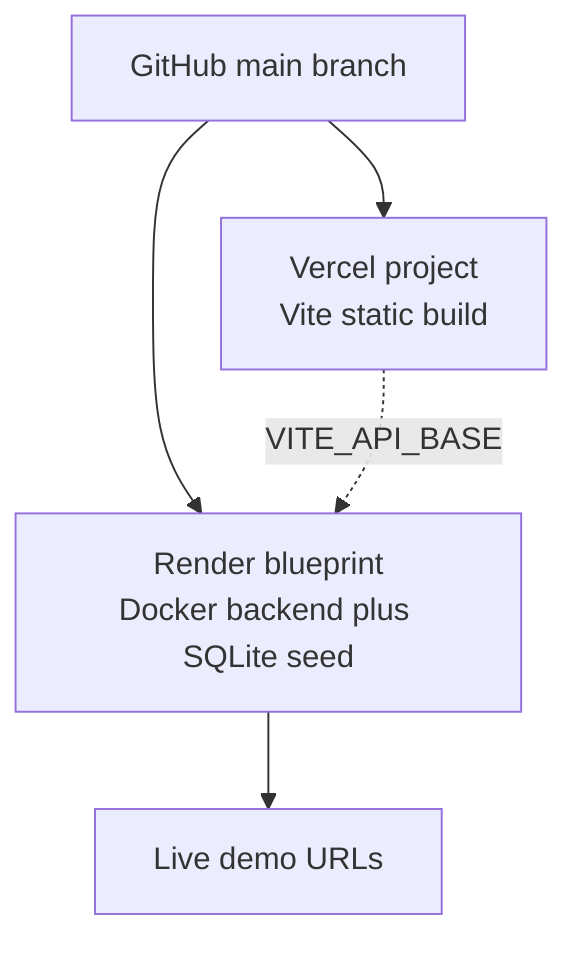

Every push runs CI in parallel before anything can merge:

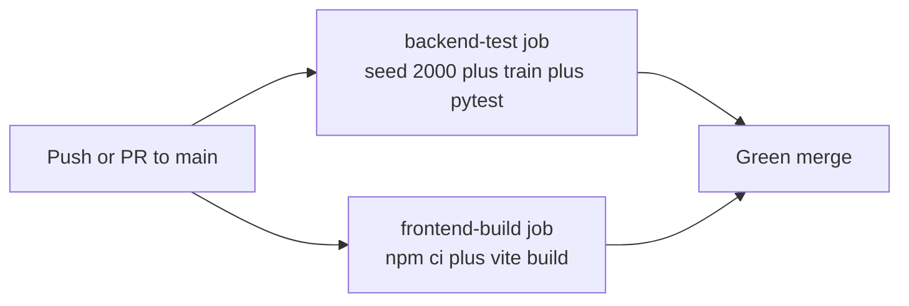

---

## 🚀 Quickstart

### Option A: Docker (recommended)

```bash
cp .env.example .env          # then fill in every secret
docker compose up --build -d
```

| Service | URL |
|---|---|
| App | http://localhost:5173 (nginx proxies `/api` to the backend) |
| API | http://localhost:8000 (Swagger at `/docs`) |
| n8n | http://localhost:5678 (import `workflows/*.json`, add a Postgres credential to Workflow A, then Publish) |

☁️ **Deploying for free?** See [`DEPLOY.md`](DEPLOY.md) for the $0/month cloud guide.

### Option B: Local development

<details>
<summary><b>Backend</b></summary>

```bash
cd backend
python -m venv .venv && .\.venv\Scripts\activate   # Windows
pip install -r requirements.txt
python app/db/seed_data.py 10000                   # generate synthetic dataset
python app/ml/train.py                             # (optional) retrain + refresh artifacts
uvicorn app.main:app --reload --port 8000
```

</details>

<details>
<summary><b>Frontend</b></summary>

```bash
cd frontend
npm install
npm run dev                                        # http://localhost:5173
```

</details>

### Demo accounts

Seeded fake accounts for local evaluation. They unlock nothing real.

| Persona | Email | Password | Permissions |
|---|---|---|---|
| **Alex Rivera** · Dispatcher | `alex.dispatcher@logistics.copilot` | `dispatcher123` | Read + query |
| **Sarah Jenkins** · Ops Manager | `sarah.manager@logistics.copilot` | `manager123` | + upload/delete docs, trigger workflows |
| **Operations Admin** | `admin@logistics.copilot` | `admin123` | Full permissions |
| **Logistics Analyst** · Viewer | `viewer@logistics.copilot` | `viewer123` | Read-only audit |

---

## 📡 API Reference

Base path: `/api/v1`. Interactive docs are served at [`/docs`](https://tracc-backend.onrender.com/docs).

| Domain | Endpoints |
|---|---|
| **Auth** | `POST /auth/login` · `GET /auth/me` |
| **Copilot chat** | `POST /copilot/chat` · `POST /copilot/chat/stream` *(SSE)* |
| **Loads** | `GET /loads` · `GET /loads/{id}` |
| **Carriers & drivers** | `GET /carriers…` · `GET /drivers…` |
| **Analytics** | `GET /analytics/kpis` · `/revenue-trends` · `/carrier-performance` *(with `weekly_on_time`)* · `/lane-trends` |
| **Predictions** | `GET /predictions/load/{id}` · `GET /predictions/batch/high-risk` |
| **AI** | `POST /copilot/query` · `POST /rag/query` · `POST /agent/chat` |
| **Knowledge base** | `GET /rag/documents` · `POST /rag/upload` · `DELETE /rag/documents/{id}` · `GET /rag/documents/{id}/chunks` |
| **Alerts** | `GET /alerts` · `POST /alerts/{id}/resolve` · `POST /alerts/trigger/{workflow_a\|workflow_b\|workflow_c}` |

---

## ✅ Quality & Testing

```bash
python -m pytest tests/ -v     # 89 backend tests
cd frontend && npm run lint    # tsc --noEmit
npm run build                  # production build
```

The backend suite covers **auth, data, SQL guardrails and self-repair, RAG, the agent, chat intents, entity resolution, uploads, deletes, streaming, and rate limits**. CI runs the backend tests and the frontend build on every push via GitHub Actions.

---

## 📁 Project Structure

```text
tracc/
├── backend/            FastAPI app: api, core, db, ml, schemas, services
├── frontend/           React + Vite + Tailwind: dashboard, copilot, load board, risk, knowledge, alerts
├── tests/              pytest suite (test_api.py)
├── workflows/          n8n definitions: delayed-load, daily-ops, carrier-breach
├── analytics/          Power BI star-schema exporter + DAX guide
├── docs/               Requirements, decisions, runbook, AI quality guide, screenshots
├── .github/workflows/  CI: backend tests + frontend build
├── docker-compose.yml  Dockerfile.backend · Dockerfile.frontend · nginx.conf
└── PROJECT_STATUS.md   Live status & remaining-work tracker
```

---

## 📚 Documentation

| Document | Purpose |
|---|---|
| [`docs/product-requirements.md`](docs/product-requirements.md) | Product requirements (PRD) |
| [`docs/OPERATIONS_RUNBOOK.md`](docs/OPERATIONS_RUNBOOK.md) | Backups, scanning, audit review |
| [`docs/AI_QUALITY_EVALUATION.md`](docs/AI_QUALITY_EVALUATION.md) | Pilot acceptance criteria for AI quality |
| [`docs/INTEGRATION_DECISIONS.md`](docs/INTEGRATION_DECISIONS.md) | Integration decisions and rationale |
| [`DEPLOY.md`](DEPLOY.md) | Free cloud deployment guide |
| [`PRODUCT.md`](PRODUCT.md) · [`PROJECT_STATUS.md`](PROJECT_STATUS.md) | Product context and live project status |

---

## ⚖️ Known Limitations

Deliberate trade-offs, documented for transparency.

| Area | Trade-off |
|---|---|
| **Money type** | Stored as `Float`, which is fine for synthetic demo data. A production ledger should migrate to `Numeric(12, 2)`. |
| **Timestamps** | UTC-naive datetimes suit single-timezone operations but are insufficient for multi-timezone production. |
| **LLM quotas** | Free tiers (OpenRouter ~50 req/day, NVIDIA NIM RPM-capped) fall back to offline heuristics when exhausted. The app stays fully usable; responses become templated. |
| **Demo credentials** | One-click logins for the seeded dataset only. |
| **Business thresholds** | Risk bands, the 14-day window, breach rate, and the 48 mph limit live in `backend/app/core/business_rules.py`: one place, human-tuned, not learned. |

---

## 🗺️ Roadmap

Shipped, then direction — ideas, not promises.

| Status | Item |
|---|---|
| ✅ Shipped | Conversational copilot with streaming, memory, and name resolution |
| ✅ Shipped | Explainable delay prediction with SHAP factor attribution |
| ✅ Shipped | n8n automation verified firing against the live backend |
| ✅ Shipped | Free cloud deployment (Render + Vercel) |
| 🔭 Next | Slack/Teams notifications for breach alerts |
| 🔭 Next | Live TMS/ELD feed adapter beside the synthetic dataset |
| 🔭 Next | True token streaming from providers (currently word-chunked server-side) |
| 🔭 Next | Mobile-first pass on the load board and drawer |

---

## ❓ FAQ

<details>
<summary><b>Do I need API keys to run it?</b></summary>

No. Without keys the copilot runs on offline heuristics: intent routing, entity resolution, guardrailed SQL with canned safe queries, and cited SOP retrieval all work. Keys (OpenAI / Gemini / OpenRouter / NVIDIA) unlock full prose synthesis, with automatic failover between providers.

</details>

<details>
<summary><b>Is any of this data real?</b></summary>

No — the entire dataset is synthetic (10,000 loads, 500 carriers, 2,000 drivers) generated by `seed_data.py`. The cloud demo reseeds itself on every restart. Nothing here touches real freight, real companies, or real people.

</details>

<details>
<summary><b>Do I need PostgreSQL or n8n to run it?</b></summary>

Neither, for most uses. SQLite is the automatic local fallback, and the native in-app runner executes all three workflows without n8n. Docker Compose adds Postgres + pgvector and n8n for the full production-like stack.

</details>

<details>
<summary><b>Why do answers sometimes turn templated?</b></summary>

Free-tier LLM quotas (OpenRouter ~50 requests/day, NVIDIA RPM-capped) fall back to offline heuristics when exhausted. Structure, citations, tables, and traces stay correct — only the prose gets plainer until quota resets.

</details>

<details>
<summary><b>Can I use this commercially?</b></summary>

The code is MIT-licensed, but treat it as a demo-grade starting point: money is `Float`, timestamps are UTC-naive, JWTs can't be revoked, and the data is fictional. See [Known Limitations](#known-limitations).

</details>

---

## 🤝 Contributing

Contributions are welcome.

1. Fork the repository and create a feature branch.
2. Make your changes, and add or update tests where behavior changes.
3. Verify locally: `python -m pytest tests/ -v`, `npm run lint`, and `npm run build`.
4. Open a pull request describing the change and its motivation.

---

## 📄 License

Released under the **MIT License**. See [`LICENSE`](LICENSE).

<div align="center">
<br/>

Built by [**Yash Gangal**](https://github.com/YashGangal)

<sub>If Tracc is useful to you, consider giving it a ⭐</sub>

</div>
